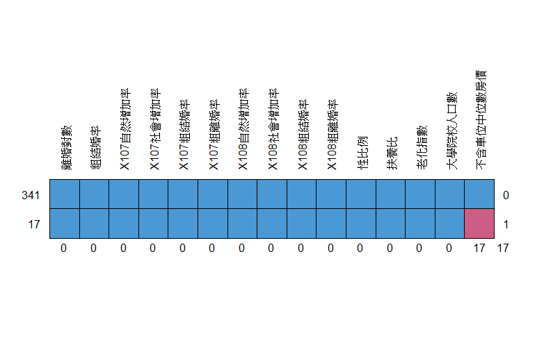
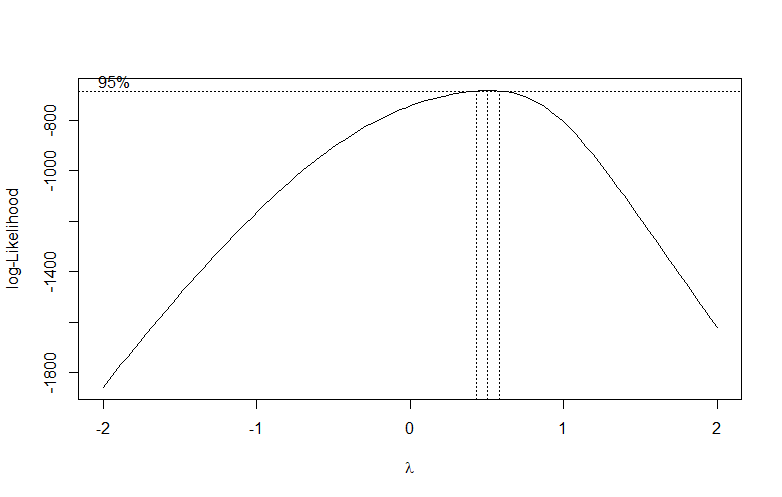
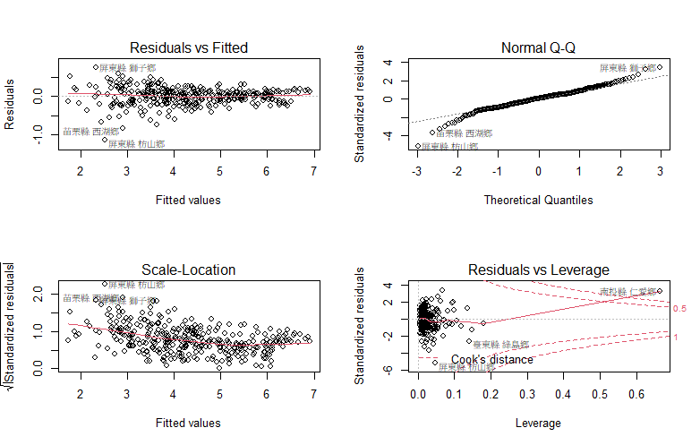
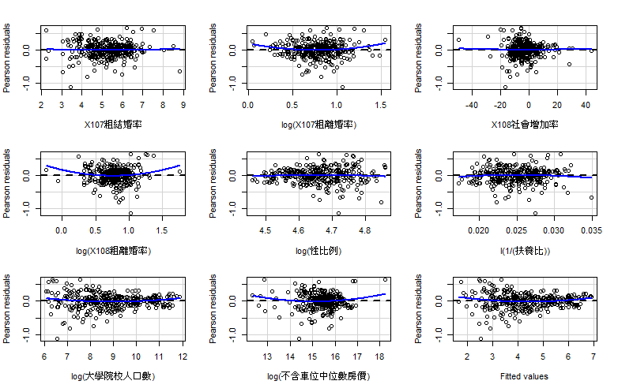

# 台灣離婚對數分析
### **Data Desciption**:
以年度離婚對數作為應變數，解釋變數則以當年度之國民教育程度、房價，以
及前一年之人口消長指標等直覺認為與今年度離婚數有關之變數做挑選；相較
於１１０年，該平台於１０９年之年度行駐區資料較為完整，故選用１０９年
我行政區離婚對數作為應變數。\
空間範圍：全國\
空間統計單元：鄉鎮市區\
樣本數：358\
缺失值：17\

## **Abstract**
* 遺失值處理\
**mice**
```r
library(mice)
require(mice)
mice <- data.frame(md.pattern(Divdata, rotate.names = TRUE))
```


* 共線性診斷\
**vif**
```r
library(car)
car::vif(lm)
```
```r
> car::vif(lm)
          粗結婚率     X107社會增加率       X107粗結婚率       X107粗離婚率 
          2.938035           1.313099           2.809047           1.767713 
    X108社會增加率       X108粗結婚率       X108粗離婚率             性比例 
          1.369629           2.521400           1.696573           3.046758 
            扶養比           老化指數     大學院校人口數 不含車位中位數房價 
          1.879079           3.431385           1.940453           1.169135 
```
* 挑選變數(向前、後、逐步選取法)
```r
#向前選取
full <- formula(lm)
m0 <- lm(Divdata$離婚對數 ~ 1, Divdata) # the base model
m.forward <- step(m0, scope=full, direction="forward")
#向後選取
m1 <- update(m0, full) #full model
m.backward <- step(m1, direction="backward")
#stepwise
m.stepwise <- step(m1, direction="both")
```
* 殘差分析\
**Box Cox powertransform**
```r
library(MASS)
boxcox <- boxcox(lm)
lambda <- boxcox$x[which.max(boxcox$y)]
```


```r
plot(lmm)
residualPlots(lmm) 
```



\
**檢定**

```r
> ks.test(scale(lmlog$residuals),pnorm)

	One-sample Kolmogorov-Smirnov test

data:  scale(lmlog$residuals)
D = 0.06455, p-value = 0.1166
alternative hypothesis: two-sided
```


